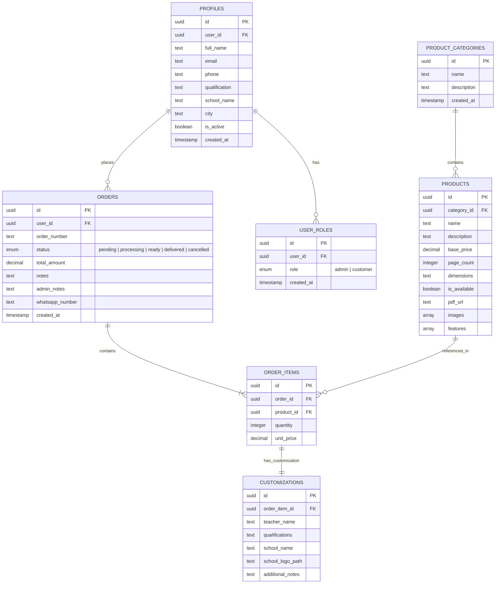

# Data Model & Database Schema: Etqan EduPlatform

The platform models an e-commerce customization domain tailored to educational institutions and instructors.

```mermaid
erDiagram
    PROFILES ||--o{ ORDERS : places
    PROFILES ||--o{ USER_ROLES : has
    PRODUCT_CATEGORIES ||--o{ PRODUCTS : contains
    ORDERS ||--|{ ORDER_ITEMS : contains
    PRODUCTS ||--o{ ORDER_ITEMS : referenced_in
    ORDER_ITEMS ||--|| CUSTOMIZATIONS : has_customization

    PROFILES {
        uuid id PK
        uuid user_id FK
        text full_name
        text email
        text phone
        text qualification
        text school_name
        text city
        boolean is_active
        timestamp created_at
    }

    USER_ROLES {
        uuid id PK
        uuid user_id FK
        enum role "admin | customer"
        timestamp created_at
    }

    PRODUCT_CATEGORIES {
        uuid id PK
        text name
        text description
        timestamp created_at
    }

    PRODUCTS {
        uuid id PK
        uuid category_id FK
        text name
        text description
        decimal base_price
        integer page_count
        text dimensions
        boolean is_available
        text pdf_url
        array images
        array features
    }

    ORDERS {
        uuid id PK
        uuid user_id FK
        text order_number
        enum status "pending | processing | ready | delivered | cancelled"
        decimal total_amount
        text notes
        text admin_notes
        text whatsapp_number
        timestamp created_at
    }

    ORDER_ITEMS {
        uuid id PK
        uuid order_id FK
        uuid product_id FK
        integer quantity
        decimal unit_price
    }

    CUSTOMIZATIONS {
        uuid id PK
        uuid order_item_id FK
        text teacher_name
        text qualifications
        text school_name
        text school_logo_path
        text additional_notes
    }
```
